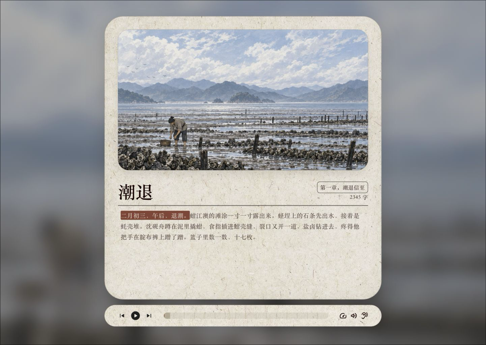

# 小说转图文有声书 Skill

> 私有测试版：把一部现成小说或一篇短篇小说，转换成可继续剪辑和发布的图文有声书素材包。

这个 Skill 不负责创作小说。它从用户提供的正文开始，调用 Codex 完成内容拆分与连续分镜，调用阿里云百炼完成中文角色配音，再通过 FFmpeg 完成裁切、拼接、响度统一、动作音效和时间轴同步。

## 效果预览

[](docs/index.html)

仓库内同时提供了一个可操作的 UI Demo，支持：

- 播放、暂停、拖动进度和切换倍速；
- 上一幕、下一幕和键盘方向键切换；
- 随剧情更换分镜、人物信息、正文和音频；
- 桌面端与移动端自适应；
- 键盘焦点、无障碍标签和“减少动态效果”设置。

### 本地打开交互 Demo

克隆仓库后执行：

```bash
python3 -m http.server 8080 --directory docs
```

浏览器访问：

```text
http://127.0.0.1:8080/
```

如果之后公开仓库，可以把 GitHub Pages 的发布来源设置为 `main` 分支的 `/docs` 目录，现有 Demo 无需改造即可作为在线演示。

## 它能完成什么

一篇小说进入流程后，会得到四类处理：

1. **拆内容**：识别角色、场景、动作、旁白、台词和音效触发点；
2. **画分镜**：选择关键剧情节点，生成前后一致的连续图片；
3. **配声音**：给旁白和每个角色绑定稳定音色，并根据场景调整语速、停顿和情绪；
4. **做后期**：合成角色音轨，加入动作音效，统一响度并生成字幕与时间轴。

```text
小说正文
   ↓
角色 / 场景 / 动作 / 台词清单
   ↓
连续分镜图片 + 多角色语音
   ↓
音频后期 + 字幕 + 镜头时间轴
   ↓
图文有声书素材包
```

## 使用的平台和工具

- **Codex**：阅读正文、拆分剧情、生成分镜、维护项目文件并执行工作流；
- **阿里云百炼**：通过 `bl` CLI 调用中文语音合成模型，生成旁白和角色音轨；
- **FFmpeg / FFprobe**：完成裁切、拼接、淡入淡出、响度统一和音频检查；
- **Python 3.10+**：生成项目结构、TTS 计划和质检报告。

Codex 与百炼分别订阅、分别计费。百炼凭据只保存在本地 Profile 或环境变量中，不能写入仓库、脚本或项目清单。

## 安装私有测试版

```bash
git clone <private-repository-url>
cd novel-to-audiobook-skill
ln -s "$(pwd)/novel-to-audiobook" "$CODEX_HOME/skills/novel-to-audiobook"
```

重新载入 Codex 后，可直接调用：

```text
$novel-to-audiobook 把这篇短篇小说做成图文有声书素材包。
```

## 最少需要准备什么

只需要一部完整小说或一篇短篇小说。支持 Markdown、TXT，以及能够可靠提取正文的 DOCX 或 PDF。

以下内容可以选填：

- 画风参考；
- 角色形象参考；
- 声音偏好；
- 目标时长；
- 输出画面比例。

如果没有提供，Skill 会采用保守默认值，并在批量生成前让用户确认角色形象、角色声音和一段代表性成品。

## 快速开始

先初始化项目目录：

```bash
python3 novel-to-audiobook/scripts/init_project.py \
  /absolute/path/to/story.md \
  /absolute/path/to/new-project
```

确认 `manifests/segments.json` 后，生成百炼配音计划：

```bash
python3 novel-to-audiobook/scripts/build_tts_plan.py \
  /absolute/path/to/new-project
```

生成完成后执行质检：

```bash
python3 novel-to-audiobook/scripts/validate_project.py \
  /absolute/path/to/new-project
```

## 最终交付

```text
project/
├── storyboards/        # 按顺序编号的分镜图片
├── audio/
│   ├── raw/            # 百炼返回的原始角色语音
│   ├── groups/         # 长台词连续生成文件
│   ├── shots/          # 按镜头切分的音轨
│   ├── sfx/            # 动作触发音效
│   └── final/          # 最终混音
├── timeline/           # 字幕、镜头顺序与真实时间点
├── manifests/          # 角色、镜头和台词清单
└── reports/            # 自动检查与人工复核记录
```

这些文件可以直接进入剪映、Premiere 或其他剪辑软件继续制作视频，也可以用于搭建类似 Demo 中的交互式图文伴读页面。

## 关键制作原则

- 一段文字不等于一个镜头，只选择真正需要画出来的剧情节点；
- 先确定角色与场景参考图，再批量生成连续分镜；
- 一个角色始终绑定同一个 Voice ID；
- 同一角色的长信、独白或演说一次连续生成，再按镜头切分；
- 环境声不需要一直播放，只在拆信、脚步、船板受力等动作发生时加入短音效；
- 镜头时间以最终音频为准，不用估算语速代替真实时长。

## 仓库结构

```text
.
├── README.md
├── docs/                       # 可交互 UI Demo，可直接用于 GitHub Pages
└── novel-to-audiobook/
    ├── SKILL.md                # Skill 主说明
    ├── agents/openai.yaml      # Codex 展示与调用信息
    ├── assets/templates/       # 项目清单模板
    ├── references/             # 工作流、百炼调用和质检规则
    └── scripts/                # 初始化、TTS 计划与项目校验脚本
```

## 私有测试范围

- 当前仓库用于验证工作流、项目结构、配音连续性和 UI 演示；
- 不提交 API Key、用户私有小说原文或账号信息；
- Demo 使用经过筛选的短片段和压缩素材，不包含完整项目；
- 正式公开前，应再次检查示例素材授权、百炼模型名称和订阅说明。
